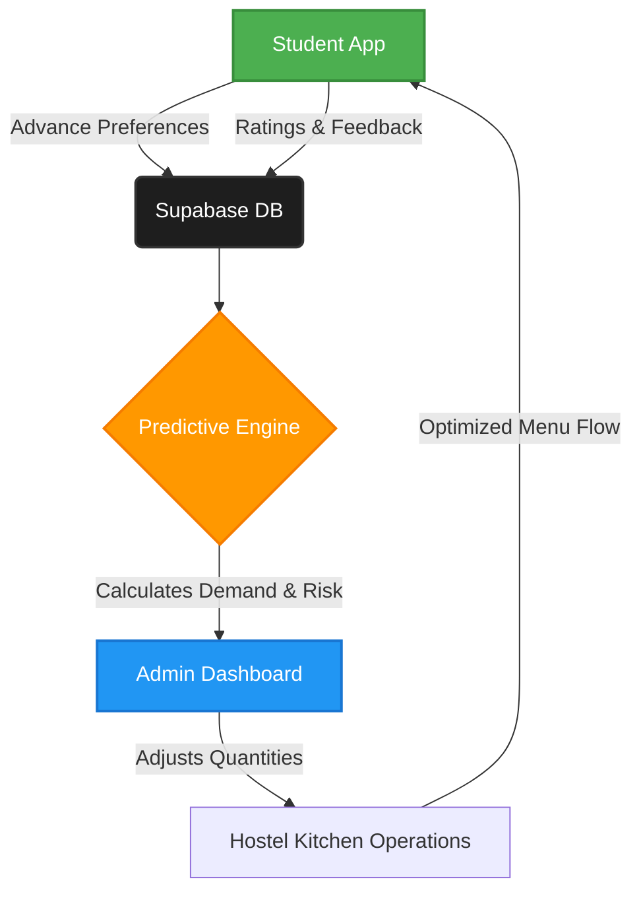

  

  

  
  
  
  

---

## 🎯 The Core Problem

In hostel mess facilities, students rely on static notice boards. This lack of digitization leads to massive systemic inefficiencies:

| ❌ The Problems | 📉 The Impact |
| --- | --- |
| **Nutritional Blindness** | Students cannot track their Calorie, Protein, Carb, or Fat intake. |
| **Disconnected Preferences** | Management cooks blindly without knowing what students actually want to eat. |
| **High Food Wastage** | Bulk cooking of low-demand dishes results in massive daily food waste. |
| **Dietary Obscurity** | Students with specific dietary profiles (Veg/Non-Veg/Special) lack transparent choices. |

---

## ✨ Our Revolutionary Solution

**FitVIT** is an intelligent, dual-platform ecosystem designed to be effortlessly accessible for students and profoundly insightful for mess management.

### 📱 1. Student Experience App
*Empowering students with dietary transparency and a loud voice.*

- 🍽️ **Digital Daily Menus:** Beautiful UX displaying daily menus organized by exact dietary profiles.
- 🥗 **Nutritional Transparency:** Granular macro breakdowns (**Calories, Protein, Carbohydrates, Fats**) for every single dish.
- ⭐ **Actionable Feedback Loop:** Instant dish rating out of 5 stars + qualitative feedback driving quality control.
- 📅 **Advance Preference Mapping:** Students lock-in their choices for Regular and Feast Menus, preventing over-preparation.

### 💻 2. Admin Intelligence Dashboard
*Transforming guesswork into data-driven operations.*

- 🧠 **Predictive Demand Engine:** ML-driven analytics model predicting real-time demand down to the exact dish.
- ♻️ **Waste Management Triage:** Automated system flagging dishes as **`HIGH RISK`**, **`WATCH`**, or **`SAFE`** for wastage.
- 📊 **Dietary Vault Analytics:** Stunning visualizations mapping the entire demographic footprint of the student body.

---

## 🏗️ System Architecture

---

## 🗂️ Branch Strategy (Monorepo)

| Branch | Description | Status |
|--------|-------------|--------|
| **[`main`](https://github.com/Sappy101/fitVIT/tree/main)** | Core documentation & Solvathon overview. | 🟢 **Active** |
| **[`app`](https://github.com/Sappy101/fitVIT/tree/app)** | Source code for the Student App & Admin Dashboard. | 🟢 **Active** |
| **[`website`](https://github.com/Sappy101/fitVIT/tree/website)** | Source code for the web portal. | 🟡 **In Dev** |

---

## 🛠️ Tech Stack & Magic Under the Hood

  

* **Frontend:** React Native (Expo Router) paired with a custom *Living Greenhouse* UI System
* **Backend:** Supabase (PostgreSQL, Auth, Edge Functions)
* **Intelligence:** Python-based ML predictive engine
* **Analytics:** React Native Chart Kit for immersive data visualization

---

  
<i>Concepted, Designed, and Built with ❤️ for Solvathon Optimization</i>

